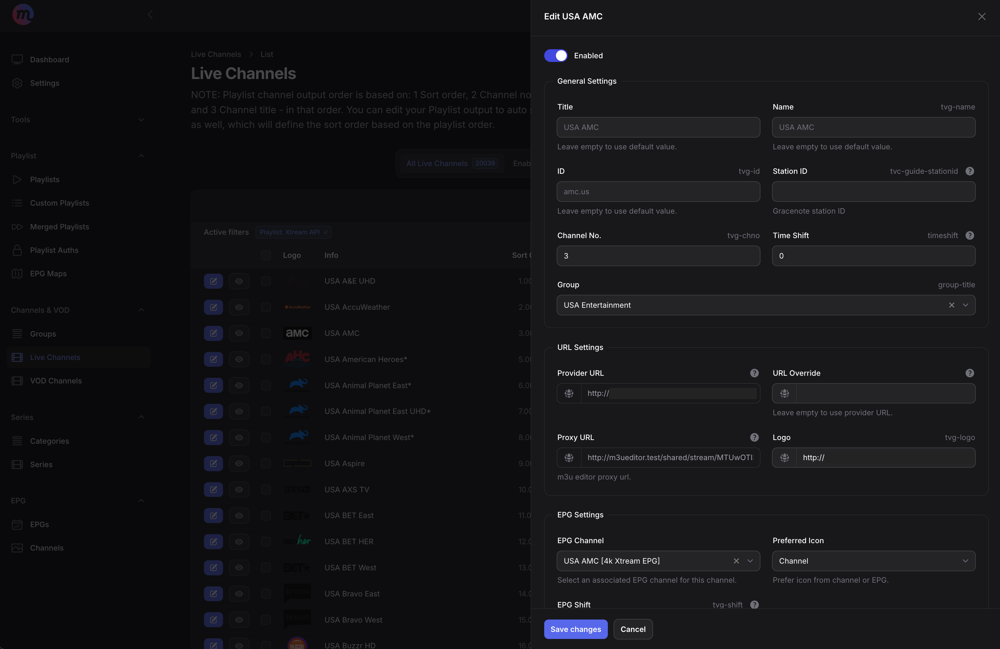
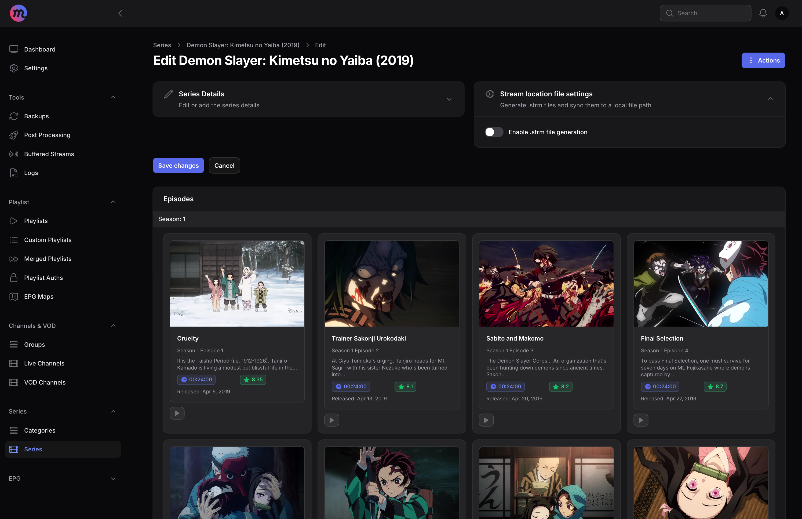
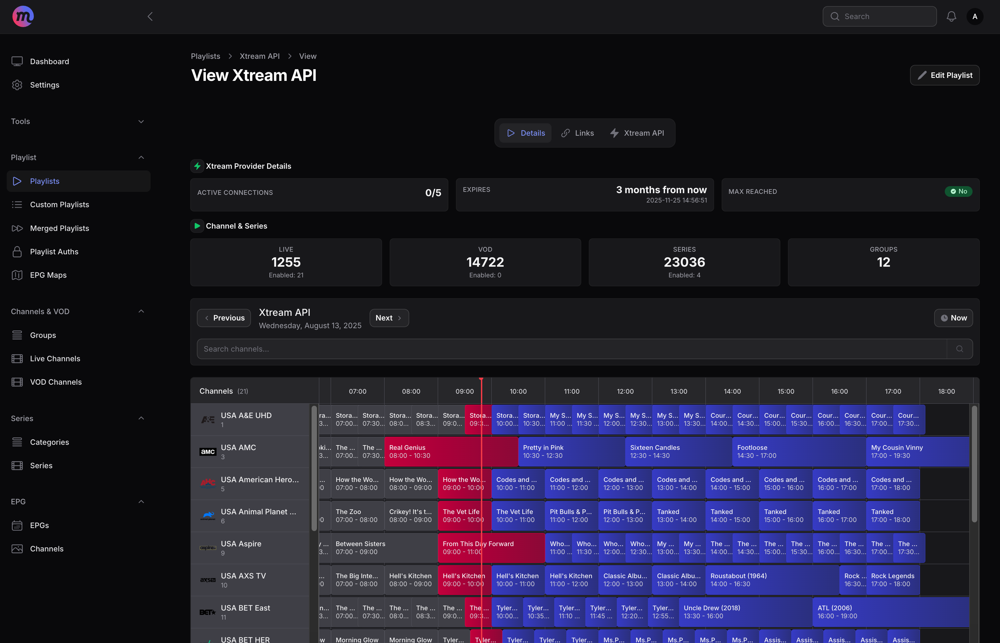
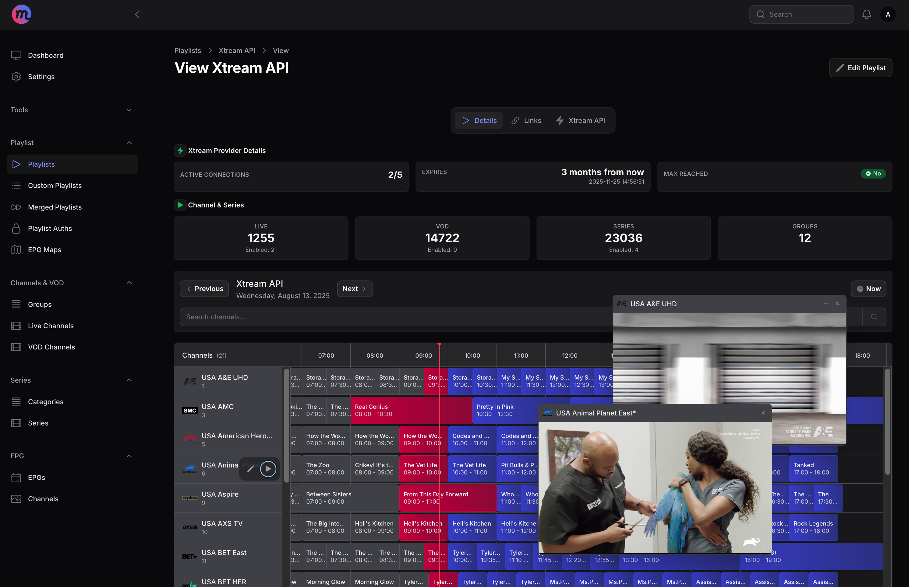
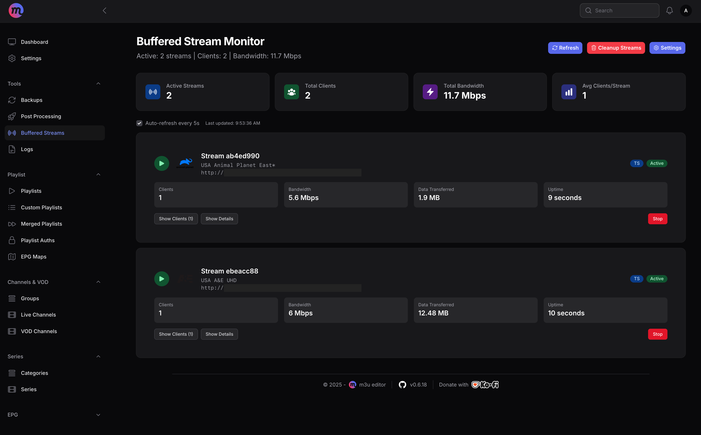
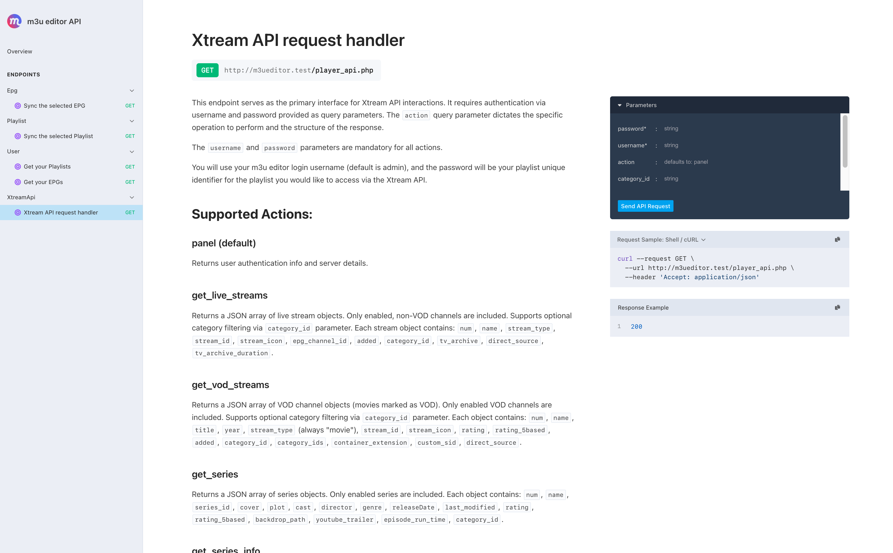

  

  <h3>m3u editor</h3>

  [English](./README.md) | 中文

一个功能完整且强大的 `IPTV` 编辑器，提供与 **xteve** 或 **threadfin** 类似的能力。它还内置了完整的 `EPG` 管理、完整的 Xtream API 输出、剧集管理（支持存储与同步 `.strm` 文件）、自定义能力（可调用自定义脚本、发送 webhook 请求或发送电子邮件）以及更多丰富功能！

支持 m3u、m3u8、m3u+ 与 Xtream Codes API！

支持 XMLTV 格式的 EPG 数据，包括本地或远程 XMLTV 文件、XMLTV URL，以及完整的 **Schedules Direct** 集成。

### 问题 / 异常 / 建议

欢迎在此仓库中 [提交 issue](https://github.com/sparkison/m3u-editor/issues/new?template=bug_report.md)，或加入我们的 [Discord](https://discord.gg/rS3abJ5dz7)

### 加入我们的 Discord

欢迎加入我们的 [Discord](https://discord.gg/rS3abJ5dz7) 来提问，获取他人帮助或者帮助他人，提出新想法或者给出改进建议！你也可以抢先体验并协助测试新功能！🎉

## 使用流程

- ~~系统中已安装 [Docker](https://www.docker.com/)。
- Xtream Codes API 的登录信息，或包含直播流的 M3U 订阅地址或者文件。
- （可选）包含有效 XMLTV 数据的 EPG 订阅地址或者文件。~~

## 📖 文档

查看文档：[m3u editor docs](https://sparkison.github.io/m3u-editor-docs/)（英文版本，这部分我们也很欢迎您帮助汉化与更新……）

## 🐳 Docker 快速开始 <small><code>v0.8.x+</code></small>
> [!IMPORTANT]
> - **默认用户名：** admin
> - **默认密码：** admin
> - **默认端口：** 36400

| 使用场景 | 文件 | 说明 |
| --------------------------- | ------------------------------------------------------- | ---------------------------------------------------------------------------------------------------- |
| **模块化部署** | [docker-compose.proxy.yml](./docker-compose.proxy.yml) | ⭐⭐ 推荐！ 将编辑器、代理服务及 Redis 拆分为独立容器运行。这种方案控制粒度更细，且支持硬件加速（需配合外部代理）。你也可以根据需要轻松扩展 Postgres 或 NGINX 容器。|
| **模块化 + VPN** | [docker-compose.proxy-vpn](./docker-compose.proxy-vpn.yml) | 在模块化部署的基础上，集成了 Gluetun VPN 的配置示例，适合对网络环境有特殊需求的情况。 |
| **一体化部署** | [docker-compose.aio.yml](./docker-compose.aio.yml) | 极简首选。 所有服务均集成在单个容器中，开箱即用，适合快速上手。但需注意，此方案不支持硬件加速。 |

### 🔥 高级 Docker 配置 <small><code>v0.8.x+</code></small>

| 使用场景 | 文件 | 说明 |
| --------------------------- | ------------------------------------------------------- | ------------------------------------------------------------------------------------------------------ |
| **完全模块化（Nginx）** | [docker-compose.external-all.yml](./docker-compose.external-all.yml) | 深度拆分所有组件并配合 Nginx 进行反向代理。详细配置与案例可参考[外部服务配置文档](./docs/docker-compose.external-services.md) |
| **完全模块化（Caddy）** | [docker-compose.external-all-caddy.yml](./docker-compose.external-all-caddy.yml) | 类似于 Nginx 方案，但改用 Caddy 作为网关。Caddy 的优势在于能自动处理 HTTPS 证书，配置更省心。|

快来查阅我们的[入门指南](https://sparkison.github.io/m3u-editor-docs/docs/about/getting-started/)吧！只需短短几分钟，就能轻松完成部署并开启你的使用之旅！🥳

---

## 📸 截图

---

## 🤝 想要参与？

> 无论是编写文档、修复 Bug，还是开发新功能，我们欢迎您的加入！❤️

我们欢迎 **PR、issue、想法与建议**！\
你如果有这样的好习惯，欢迎加入我们：

- 遵循我们的编码风格与最佳实践。
- 保持尊重、乐于助人，并保持开放心态。
- 遵守 **CC BY-NC-SA 许可证**。

1. Fork 仓库
2. 创建功能分支
3. 为新功能添加测试
4. 提交 Pull Request

---

## ⚖️ 许可证  

> m3u editor 使用 **CC BY-NC-SA 4.0** 许可证：  

- **BY**：保留原作者署名。  
- **NC**：禁止商业用途。  
- **SA**：若基于本项目进行再创作，需以相同方式共享。  

完整许可证内容请参阅 [LICENSE](https://creativecommons.org/licenses/by-nc-sa/4.0/)。
