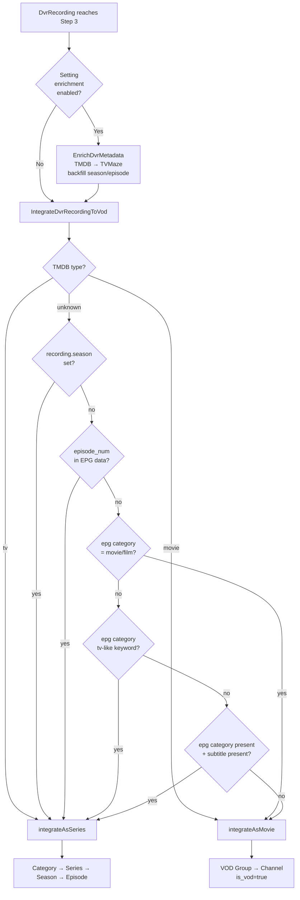

# DVR → Series vs VOD Classification

How a completed `DvrRecording` is routed into either a TV **Series → Season → Episode** chain, or a single **VOD movie Channel**.

## When classification runs

After a recording finishes, `DvrPostProcessorService` runs a 5-step pipeline. Step 3 is the classification trigger:

| Step | What |
|---|---|
| 0 | Download HLS from proxy |
| 1 | FFmpeg concat → final file |
| 2 | Persist `file_path`, `file_size_bytes`, `duration_seconds` |
| **3** | **Dispatch enrichment + VOD integration** |
| 4 | Cleanup proxy + flip status to `Completed` |

Step 3 branches on `DvrSetting.enable_metadata_enrichment`:

- **Enabled** → `EnrichDvrMetadata` (queue `dvr-meta`) runs 5 enrichment passes:
  1. **Show-level** metadata from TMDB → TVMaze (identifies the show)
  2. **EPG backfill** — parse `epg_programme_data.episode_num` if season/episode columns are null
  2b. **Description-prefix backfill** — providers that embed S/E in `<desc>` (e.g. `"S01 E06 Landfall\nSynopsis..."`)
  2.5. **Air-date resolution** — last-resort TMDB lookup matching `programme_start` against episode `air_date` across all seasons
  3. **Episode-level** metadata from TMDB → TVMaze (plot, still image)
  
  Then → chains `IntegrateDvrRecordingToVod` (queue `dvr-post`)
- **Disabled** → `IntegrateDvrRecordingToVod` directly

(`app/Services/DvrPostProcessorService.php:171-194`)

## The decision: `isTvContent()`

`app/Services/DvrVodIntegrationService.php` — six checks, **first hit wins**:

```php
1. metadata.tmdb.type === 'tv'        → Series
   metadata.tmdb.type === 'movie'     → VOD movie   (authoritative)
2. recording.season  !== null         → Series
3. epg_programme_data.episode_num     → Series
4. epg_programme_data.category contains 'movie' or 'film'   → VOD movie
5. epg_programme_data.category contains 'series', 'episode',
   'tv', 'show', 'news', 'documentary', or 'talk'           → Series
6. epg_programme_data.category present (any other non-empty
   value, e.g. 'sports', 'entertainment')
   AND recording.subtitle non-empty                         → Series
   (otherwise → VOD movie)
```

Signals 4-6 (Flaw #4 fix) catch programmes whose providers don't emit
`episode-num` tags but do supply a `<category>` (very common for talk shows,
news, sports, late-night). Subtitle alone is **not** a TV signal because some
providers tag movies with subtitles for director's cuts / extended editions —
we only trust subtitle-as-TV when paired with an EPG category. Explicit
`category=movie` always overrides subtitle.

## Decision flow



### Episode-number resolution order (enrichment passes)

When enrichment is enabled, the season/episode numbers are resolved in this priority order:

| Priority | Source | Enrichment pass | Example |
|---|---|---|---|
| 1 | `recording.season` / `recording.episode` columns | (already set from EPG at schedule time) | — |
| 2 | `epg_programme_data.episode_num` | Pass 2 — backfill | `S02E05` → season=2, episode=5 |
| 3 | `description` prefix (embedded S/E) | Pass 2b — description-backfill | `"S01 E06 Landfall\n..."` → s=1, e=6 |
| 4 | TMDB air-date matching | Pass 2.5 — air-date | `programme_start=2014-07-06` + TMDB s1e6 `air_date=2014-07-06` → s=1, e=6 |
| 5 | MMDD synthesis (at integration time) | — | Apr 30 → episode 430 |

Passes 2, 2b, and 2.5 are **opportunistic** — they only run when the columns are still null
and the necessary data is available (EPG data present, description present, TMDB show
identified). When all three fail, the integration step falls through to MMDD synthesis so
no recording is ever left orphaned.

## Series side

`integrateAsSeries()` — `app/Services/DvrVodIntegrationService.php:216-292`

Chain: **Category → Series → Season → Episode**

| Object | Match key | Notes |
|---|---|---|
| `Category` | `(playlist_id, name_internal='DVR Recordings')` | Always `firstOrCreate` |
| `Series` | **1.** `(playlist_id, source_series_id IS NULL, tmdb_id)` when TMDB id present<br>**2.** `(playlist_id, source_series_id IS NULL, metadata->tvmaze->id)` when TVMaze id present<br>**3.** Falls back to `(playlist_id, source_series_id IS NULL, lower(trim(name)))` | **TMDB-id → TVMaze-id → name** matching. Survives provider title renames / locale changes. Backfills `tmdb_id`/`cover`/`plot`/canonical name opportunistically when later recordings arrive with richer metadata. TMDB never gets clobbered by a later TVMaze upgrade. |
| `Season` | `(series_id, season_number)` | Default `season_number = 1` if `recording.season` null |
| `Episode` | `dvr_recording_id` | **1:1 with the recording** — re-runs update, never duplicate |

### Season + episode numbers

`recording.season ?? 1` and `recording.episode ?? resolveEpisodeNumber()`:

1. `recording.episode` column (set by enricher if `epg_programme_data.episode_num` was parseable)
2. `EpisodeNumberParser::fromRaw(epg_programme_data.episode_num)` — accepts `S01E03` literal or strict XMLTV-NS dot notation `0.2.0/13` (rejects anything with letters)
3. **Last resort**: MMDD from `programme_start` (Apr 21 → `421`) — every recording always gets a number

(`app/Services/DvrVodIntegrationService.php:301-312`, `app/Support/EpisodeNumberParser.php:40-88`)

### Episode metadata (plot / still / air date)

Preference order for filling `Episode.info`:

| Field | Priority |
|---|---|
| `plot` | `metadata.tmdb_episode.overview` → `tvmaze_episode.summary` → `tmdb.overview` (show) → `recording.description` |
| `release_date` | `tmdb_episode.air_date` → `tvmaze_episode.airdate` → `programme_start->toDateString()` |
| `movie_image` | `tmdb_episode.still_url` → `tvmaze_episode.image` → `tmdb.poster_url` (show) → source channel logo |

`metadata.tmdb_episode` is populated only when `metadata.tmdb.id` exists, type is `'tv'`, and both `season` + `episode` are set. Same gating for TVMaze fallback.

(`app/Services/DvrVodIntegrationService.php:268-278`, `app/Services/DvrMetadataEnricherService.php:167-230`)

### Episode title

`buildEpisodeTitle()` — `app/Services/DvrVodIntegrationService.php:323-350`

| Inputs | Result |
|---|---|
| `season` + `episode` | `S01E03 - {subtitle or title}` |
| `episode` only | `E03 - {subtitle or title}` |
| Neither, no metadata | `{title} — Apr 21, 2026` (date suffix prevents collisions) |
| Neither, has metadata | Cleaned `subtitle ?? title` |

## VOD (movie) side

`integrateAsMovie()` — `app/Services/DvrVodIntegrationService.php:137-211`

| Object | Match key | Notes |
|---|---|---|
| `Group` | `(playlist_id, name_internal='DVR Recordings', type='vod')` | Per-playlist VOD bucket |
| `Channel` | `dvr_recording_id` | **1:1 with the recording** |

Created `Channel` flags: `is_vod=true`, `is_custom=true`, `enabled=true`, `source_id=null` (avoids collision with Xtream-imported VOD).

### Display name

```
metadata.tmdb.name 
  ?? metadata.tvmaze.name 
  ?? "{stripped title} — {recording date}"
```

The date suffix is the safety net for repeated unmapped recordings (e.g. nightly news bulletins) so they remain individually identifiable.

### Info / artwork

`channel.info` is filled with `plot`, `cover_big`, `movie_image`, `release_date`, `tmdb_id` — all preferring TMDB → TVMaze → source channel logo → recording's own `description` / `programme_start`.

## Source fields on `DvrRecording`

| Field | Used for |
|---|---|
| `metadata.tmdb.type` | **Authoritative classification** (signal #1) |
| `season` (column) | Classification signal #2; `Episode.season`, `Season.season_number` |
| `episode` (column) | `Episode.episode_num` |
| `epg_programme_data.episode_num` (JSON) | Classification signal #3 + `EpisodeNumberParser` fallback |
| `metadata.tmdb`, `metadata.tvmaze` | Names, plots, art, release dates |
| `metadata.tmdb_episode`, `metadata.tvmaze_episode` | Episode-level enrichment (plot/still/air date) |
| `programme_start` | `release_date` fallback, MMDD episode derivation, date suffixes |
| `title` / `subtitle` / `description` | Final fallbacks for name / episode title / plot |
| `dvr_setting_id` → `playlist_id` | Scope of all `firstOrCreate` lookups |

> ⚠️ `tmdb_episode` and `tvmaze_episode` are **JSON keys inside `metadata`**, not separate DB columns. `episode_num` lives inside `epg_programme_data`.

## Edge cases

| Scenario | Result |
|---|---|
| Enrichment disabled | Classification falls through to `season` / `episode_num` checks |
| All TMDB + TVMaze lookups miss | Series name = stripped recording title; cover/plot left null (or source channel logo) |
| TV recording with no parseable episode anywhere | MMDD (e.g. `421`) — never orphaned. See below for resolution order. |
| TMDB says `'movie'` but `season` is set from EPG | TMDB wins (rule #1 short-circuits) |
| Programme has subtitle but EPG `category='movie'` | Movie path (rule #4 overrides subtitle) |
| Talk show / late-night with no S/E but EPG `category='series'` or `'show'` | Series path (rule #5) — episode number synthesized from MMDD |
| Sports event with subtitle and `category='sports'` | Series path (rule #6) — kept under a "Premier League" series with date-based episode numbers |
| EPG embeds S/E in description (e.g. `"S01 E06 Landfall\nPlot..."`) | Pass 2b extracts season + episode + episode title; strips prefix from description; promotes episode title to subtitle when subtitle is empty |
| EPG omits episode-num AND description has no S/E prefix, but TMDB knows the show | Pass 2.5 walks TMDB seasons looking for exact `air_date` match; succeeds only with exactly one match |
| Air-date matches multiple episodes (same date, different seasons) | Falls through to MMDD — no guessing |
| programme_start is null | Air-date pass skips — nothing to match against |
| Same recording integrated twice | Updates the existing `Episode`/`Channel` row (1:1 via `dvr_recording_id`) |
| `DvrRecording` deleted | `deleting` hook nulls `dvr_recording_id` and removes the linked `Channel` / `Episode` (transactional, re-entrance guarded) |
| Missing `DvrSetting` / `playlist_id` / `user_id` | Warn + return early; recording stays at `Completed` without VOD entry |
| Integration throws | Job retries up to 3× (Laravel queue) |
| TMDB / TVMaze 5xx / rate-limit / network error | **Not cached** — next recording with same title retries the API |
| TMDB returns `200 OK` with empty results, or TVMaze returns `404` | Cached as confirmed miss for 1h (`CACHE_MISS_TTL_SECONDS`) |

A completed recording **always** produces exactly one VOD row (Channel or Episode) unless a relation is missing or the integration job exhausts retries.

## Comparison with other DVR systems

| System | Series identity | Episode identity | Negative-cache strategy |
|---|---|---|---|
| **m3u-editor (this app)** | TMDB id first, name fallback | `(season, episode)` from EPG → backfill from `episode_num` → MMDD synthesis | Cache only on confirmed-miss (HTTP 200+empty / 404), retry on transient |
| **Jellyfin** | TheTVDB / TMDB id; identifier providers chained | TheTVDB episode id; falls back to (season, episode) match | In-memory only; no negative cache |
| **Plex DVR** | Plex match agent (TheTVDB/TMDB); user-correctable | Episode UUID from match agent | Plex Cloud match service handles caching |
| **Channels DVR** | Gracenote/TMDB id | Original air date or (season, episode) | Server-side; not exposed |
| **NextPVR** | Title only | Episode title + air date | None — re-queries each EPG refresh |

m3u-editor's distinguishing trade-offs:

- **Provider-rename resilient.** TMDB-id matching handles localized → canonical title swaps without creating duplicate `Series` rows. Most lightweight DVRs (NextPVR, MythTV) match on title only and are not.
- **EPG-driven episode identity, not air-date.** Plex / Channels prefer original air date because providers re-air old episodes; m3u-editor uses `(season, episode)` from EPG, falling back to MMDD when neither side knows. This is intentional — the EPG is the source of truth — but means a re-aired episode without S/E numbers becomes a new MMDD entry.
- **Two-layer negative cache.** Confirmed misses are cached for 1h (avoids hammering TMDB on shows it doesn't have). Transient failures (5xx, rate limit, network) are *not* cached — the next recording for the same title retries. Jellyfin / NextPVR do not distinguish; Plex offloads the entire concern to its cloud match service.
- **Exact-name preference over popularity.** TMDB returns search results sorted by its own relevance score (mostly popularity). m3u-editor re-ranks: exact case-insensitive name match wins, popularity is the tiebreaker, TMDB's array order is the final tiebreaker. Without this, a recording titled `The Office` can resolve to `The Office (UK)` when the UK version's popularity outranks the US version for the bare query. Jellyfin uses identifier providers (TheTVDB id from the EPG XMLTV `<episode-num system="tvdb">`), bypassing free-text search entirely; Plex uses its cloud match service. Channels DVR + NextPVR rely on the provider-supplied id without re-ranking.
- **Category-driven TV/movie classification.** When `episode-num` is absent, m3u-editor inspects the XMLTV `<category>` (movie/film → VOD, series/show/news/documentary/talk → Series, plus subtitle-paired tiebreaker for everything else). Most lightweight DVRs require an `episode-num` to file a programme as a series; without one they create a stray VOD row per airing — a talk show that never emits `<episode-num>` would become hundreds of disconnected VOD entries. Plex/Jellyfin sidestep the issue by relying on TheTVDB ids; Channels DVR uses Gracenote metadata, which always supplies a series identifier.

## Key files

| Concern | File |
|---|---|
| Step 3 trigger | `app/Services/DvrPostProcessorService.php` |
| Enrichment | `app/Services/DvrMetadataEnricherService.php` |
| Classification + integration | `app/Services/DvrVodIntegrationService.php` |
| `episode_num` parser | `app/Support/EpisodeNumberParser.php` |
| Enrich job | `app/Jobs/EnrichDvrMetadata.php` |
| Integration job | `app/Jobs/IntegrateDvrRecordingToVod.php` |
| Recording model + cascade-delete | `app/Models/DvrRecording.php` |
